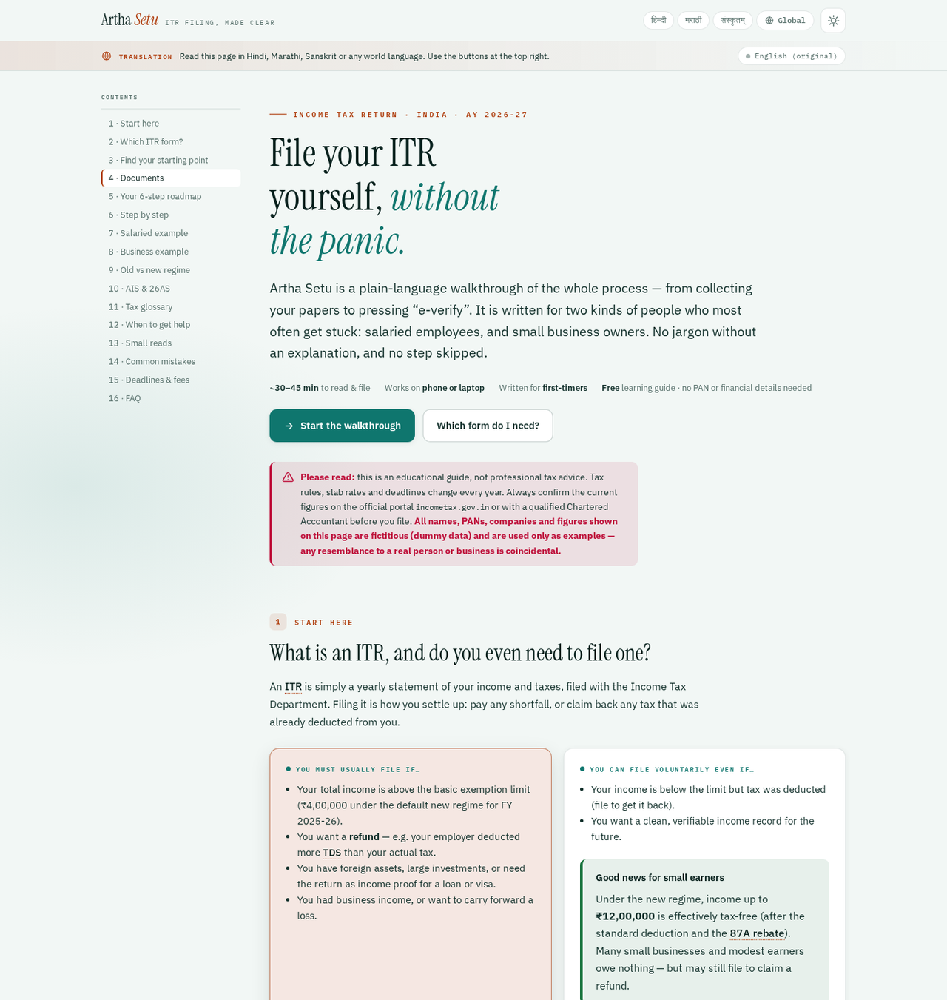

# Artha Setu — ITR filing guide

**File your Income Tax Return yourself, without the panic.**

Artha Setu is a free, single-file, plain-language guide to filing your Income Tax Return (ITR) in India. It is written for the two kinds of filers who most often get stuck — **salaried employees** and **small business owners** — and it walks from "where do I start?" to a filed and verified return.

> From *Artha* (wealth — one of the four aims of life, and the subject of Kautilya's *Arthashastra*) and *Setu* (a bridge). A bridge between you and a filed return.



---

## What's inside

- **Which ITR form?** — an interactive helper that recommends ITR-1 / ITR-2 / ITR-3 / ITR-4.
- **Find your starting point** — separate paths for salaried filers and small businesses.
- **Documents** — a tick-off checklist (remembered on the device) plus the four document categories.
- **6-step roadmap** and a detailed **9-step walkthrough**, each step with *where to click* and a *watch-out*.
- **Worked examples** — a salaried filer and a presumptive small business, computed under both tax regimes.
- **Compare, don't copy** — how to reconcile your records against AIS and Form 26AS.
- **Old vs new regime**, a **tax glossary**, **when to get professional help**, **small reads**, **common mistakes**, **deadlines & fees**, and an **FAQ**.
- **Translation** — the whole page switches to **Hindi, Marathi or Sanskrit instantly and offline**, and to any other world language on demand.

## Features

- **One file, no build step.** Everything (CSS, JavaScript, translations) is inside `index.html`. Open it and it works.
- **Mobile-first and responsive** — a sticky contents bar on phones, a sidebar contents list on desktop.
- **Light and dark themes**, following your system or a manual toggle.
- **Accessible** — semantic HTML, ARIA labels, keyboard focus states, and colour contrast checked against WCAG AA in both themes.
- **Private by default** — no accounts, no tracking, no backend. Checklist ticks stay in your browser's local storage and are never sent anywhere.
- **Translated in-page** — Hindi, Marathi and Sanskrit ship inside the file; other languages are translated on the fly and cached.

## Quick start

Just open the file:

```bash
# from the project folder
open index.html      # macOS
xdg-open index.html  # Linux
start index.html     # Windows
```

Or serve it locally:

```bash
python3 -m http.server 8000
# then visit http://localhost:8000
```

## Deploy on GitHub Pages

1. Create a new **public** repository on GitHub.
2. Upload the contents of this folder (see the two options below).
3. Go to **Settings → Pages**.
4. Under **Build and deployment**, set **Source** to *Deploy from a branch*, **Branch** to `main` and folder to `/ (root)`. Save.
5. Your site appears at `https://<your-username>.github.io/<repo-name>/` within a minute or two.

**Option A — upload in the browser.** On the new repo page choose *Add file → Upload files*, drag in `index.html`, `README.md`, `LICENSE`, `.gitignore`, `.nojekyll` and `preview.png`, then commit.

**Option B — from the command line.**

```bash
git init
git add .
git commit -m "Add Artha Setu ITR filing guide"
git branch -M main
git remote add origin https://github.com/<your-username>/<repo-name>.git
git push -u origin main
```

`.nojekyll` is included so GitHub Pages serves the file as-is without Jekyll processing.

## Project structure

```
.
├── index.html    # the entire guide (HTML + CSS + JS + translations)
├── preview.png   # screenshot used in this README
├── README.md
├── LICENSE
├── .gitignore
└── .nojekyll
```

## Customising it

Tax rules, slab rates and deadlines change every year. Every figure the page depends on lives in one place — the `ARTHA_CONFIG` object near the top of the `<script>` block in `index.html`:

```js
const ARTHA_CONFIG = {
  assessmentYear: "2026-27",
  financialYear: "2025-26",
  newRegimeRebateLimit: 1200000,
  basicExemptionNew: 400000,
  standardDeductionNew: 75000,
  standardDeductionOld: 50000
};
```

Update those values, then check the slab tables, deadline table and worked examples in the page body so they stay consistent.

To add or change a language, edit the `INDIA` / `WORLD` lists in the translation engine, or extend the embedded `ARTHA_TR` and `ARTHA_UI` data.

## How the translation works

- **Hindi, Marathi, Sanskrit** — pre-translated and embedded in the file, so they work with **no internet connection** at all.
- **Every other language** — translated in-page on first use (a network request), then cached in the browser so repeat switches are instant.

Technical terms (TDS, section numbers, form names) are intentionally left as-is so the guide stays accurate.

## Important disclaimer

Artha Setu is an **educational resource, not professional tax advice**, and it is **not affiliated with the Income Tax Department**. All names, PANs, companies and figures shown are fictitious and used only as examples. Tax rates, limits and deadlines change every year — always verify the current position on the official portal at [incometax.gov.in](https://www.incometax.gov.in) or with a qualified Chartered Accountant before filing. You file your return on the official portal, not here.

## License

Released under the [MIT License](LICENSE). You are free to use, modify and share it.

## Credits

Built by **Denny Sonkusale**. Typefaces: Instrument Serif, IBM Plex Sans and IBM Plex Mono (Google Fonts).
